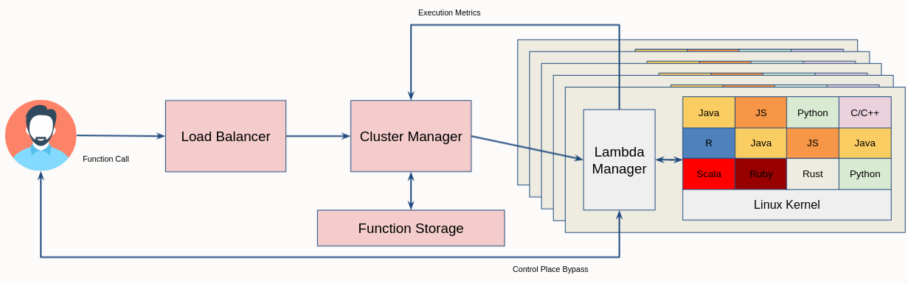

## Cluster Manager

The Cluster Manager is part of the GraalServerless (a.k.a Argo) project. For more information, please visit the [Lambda Manager](https://github.com/graalvm-argo/lambda-manager) page and the [Argo's documentation page](https://github.com/graalvm-argo/lambda-manager/blob/main/doc/Argo.md).

The Cluster Manager is responsible for managing a number of Lambda Manager. This involves forwarding Serverless function invocations to Lambda Managers depending on their current load. In addition to that, the Cluster Manager interacts with a Function Storage, a persistent storage used to keep function code (provided by the user).

An overall overview of Argo's architecture including the Cluster Manager is presented below:

This component is still under active development.
