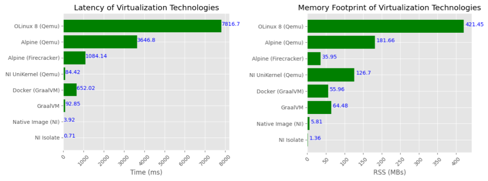
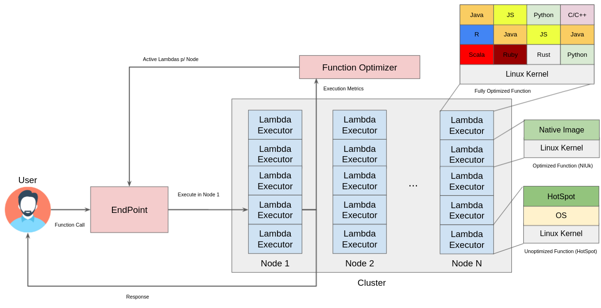
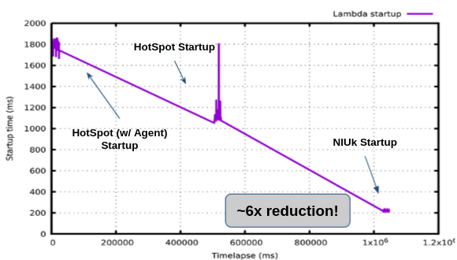
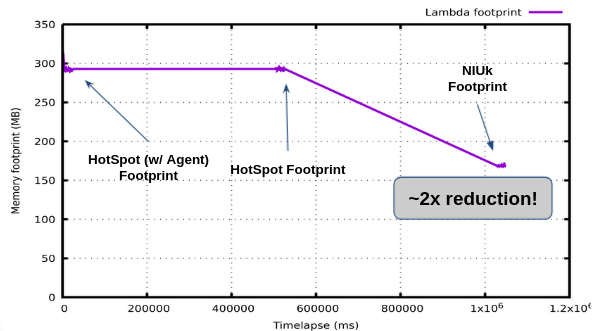
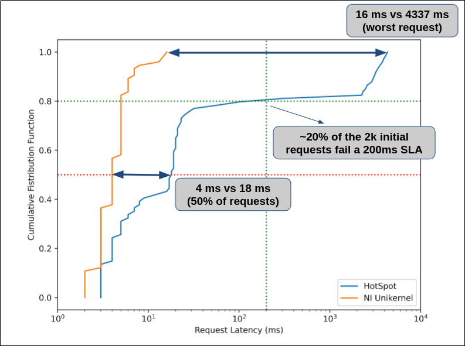
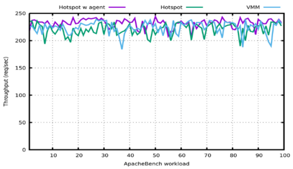
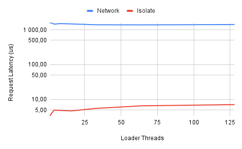

### GraalServerless (Argo)

This project aims at proposing a design and implementation of a high performance Serverless platform, empowered by technology developed by the GraalVM team. The idea is that combining the concepts of Native Image, Isolate, and Truffle, we colocate function invocations at a massive scale, resulting in both latency and memory footprint reductions compared to traditional Serverless platforms.

#### Opportunity: Language Runtimes are the new virtualization barrier in Serverless

The project relies on three main observations:

- Function-as-a-Service (FaaS) is a new programming paradigmn that has become extremely popular (estimated market value of USD 3.14B in 2017[1]) and which is still gaining momentum (estimated to reach USD 7.7B in 2021[2]);

- FaaS is executed in a Serverless approach, where users have no control over the execution environment where the function invocation is executed. Users can only select the Language Runtime version and therefore, the runtime is the new virtualization boundary. In other words, it is now possible to virtualize the runtime to service multiple function invocations at the same time;

- Current virtualization technilogy is slow and memory expensive. Launching a full VM, OS, or even a JVM takes 100s of milliseconds. Using a lightweight VM based on Native Image Unikernel can reduce both latency and memory footprint.

#### Argo: Empowering Serverless with GraalVM

Argo is a new Serverless platform whose goal is to demonstrate how to leverage advanced language runtime techniques to improve the performance of Serverless applications. Argo is not proposing a new interface to users, not how to schedule functions. On the other hand, Argo is demonstrating how to fully utilize language runtimes as a new virtualization platform to consolidate function invocations at a massive scale.

Similarly to other Serverless platforms, Argo provides an EndPoint which can be exercised through a web interface or a command-line interface. The EndPoint can be used to register new functions and invote functions.

Upon receiving a function invocation, Argo schedules the invocation to execute in a particular cluster node and lambda executor (a Virtual Machine). Depending on the invocation rate, hot functions (functions invoked frequently) will be selected for Native Image compilation, and once finished, functions execute inside a Native Image Unikernel (NIUk) VM. NIUk is a lightweight VM based on Qemu (Firecracker support is under development) that requires no Operating System and therefore achieves much lower startup latency and memory footprint.

Functions with high invocation rates will have their invocations handled in Native Image Isolates in a single NIUk VM. Isolates provide a Language Runtime abstraction which can be leveraged to encapsulate function invocations.

Applications that require functions written in multiple languages can also benefit from Native Image Isolates through Truffle. Truffle is used launch one engine per Isolate, allowing a single NIUk to host concurrent function invocations in different languages.

#### Preleminary Results

We have deployed Argo in a OCI node with 2 x Intel(R) Xeon(R) Platinum 8167M CPU @ 2.00GHz and 755 GB of memory. The workload consists of sending REST requests to Argo's endpoint. Requests are generated with ApacheBench.

###### Lambda Startup

NIUk reduces VM startup tyme by ~6x.

###### Lambda Footprint

NIUk reduces memory footprint of a VM by ~2x.

###### Lambda Initial Latency

Using NIUk significantly reduces tail latency.

###### Lambda Throughput

Using Native Image does not degrade performance compared to using HotSpot.

###### Lambda Communication

Isolate to Isolate communication is ~700x faster than going through the network. The latency of an individual request is, on average, ~200x lower with Isolate to Isolate.

#### Ongoing work

We are currently combining all these elements into a prototype of Argo. We have an early prototype demo available for you to try. Please reach out!

#### Team

- Vojin Jovanovic: management, NIUk;
- Rodrigo Bruno: team coordination, NIUk Firecracker support, Function Optimizer;
- Jovan Stevanovic: Function Optimizer, testing infrastructure;
- Serhii Ivanenko: Truffle support, Native Image feedback loop, web-interface;
- Sutao Wang: Isolate Support, Isolate-to-Isolate communication;

#### References
[1] https://www.grandviewresearch.com/industry-analysis/serverless-architecture-market

[2] https://www.cbinsights.com/research/serverless-cloud-computing/
