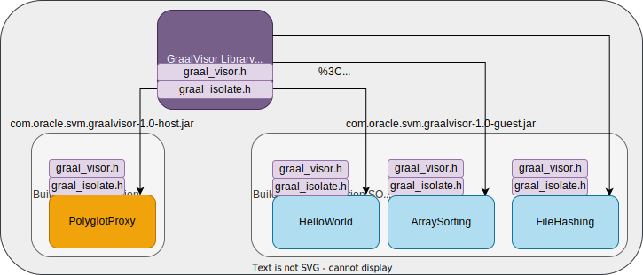

## Overview

Library for loading user application code in the form of dynamically-linked libraries in the GraalVisor.
GraalVisor loads the `.so` file and calls the invocation using the guest native api.

In this way, we don't need to build the whole application code together each time.
Once we have agreed with the invocation protocol between host and different guests (illustrated in [GraalVisorAPI](../graalvisor-lib/src/main/java/com/oracle/svm/graalvisor/api/GraalVisorAPI.java)). We could decouple the development for host and guest apart, which would be especially fit for, e.g., microservice development.

## Basic Design

[GraalVisorAPI](../graalvisor-lib/src/main/java/com/oracle/svm/graalvisor/api/GraalVisorAPI.java) uses `dlopen` to load the dynamic-link library of guest applications. Then it uses `dlsym` to find corresponding functions inside the guest application. Those function pointers are wrapped in GraalVisorAPI, and could be invoked inside the GraalVisorDemo.

On the other hand, GraalVisor also exposes its own API for each of its guests, so that guest application could invoke proxy functions in the GraalVisor. We wrap the GraalVisor address and exposed APIs in a C struct, which is defined inside [graal_visor.h](../graalvisor-lib/src/main/resources/com.oracle.svm.graalvisor.headers/graal_visor.h)). We call this struct ***graalvisor***. The Java interfaces for calling those APIs are defined inside [GuestAPI](../graalvisor-lib/src/main/java/com/oracle/svm/graalvisor/guestapi/GuestAPI.java).

When host loads the guest library, it would create the guest isolate and register the graalvisor host into it. GraalVisor inside guest works as an "entry point" for the guest to delegate their request, calling host's services.

## Key Components and Interfaces

+ [graal_visor.h](../graalvisor-lib/src/main/resources/com.oracle.svm.graalvisor.headers/graal_visor.h) Header file that describes GraalVisor C struct.

+ [GraalVisor](../graalvisor-lib/src/main/java/com/oracle/svm/graalvisor/GraalVisor.java): Definition of Java Access methods to the underlying C struct.

+ [GraalVisorAPI](../graalvisor-lib/src/main/java/com/oracle/svm/graalvisor/api/GraalVisorAPI.java) APIs used for host applications. Using GraalVisor API, the host application can load dynamically-linked library into memory. After that, the host application can create guest isolates and call invocations into them. Detailed api descriptions can be found as part of the source code [GraalVisorAPI](../graalvisor-lib/src/main/java/com/oracle/svm/graalvisor/api/GraalVisorAPI.java) in the form of comments.

+ [GuestAPI](../graalvisor-lib/src/main/java/com/oracle/svm/graalvisor/guestapi/) APIs used for guest applications. Through the APIs defined in GuestAPI, guest application can delegate different function call to the host isolate, including string copying and file manipulation. Detailed API descriptions can be found as part of the source code [GuestAPI](src/main/java/com/oracle/svm/graalvisor/guestapi/GuestAPI.java) in the form of comments.

## Build Diagram for Relevant Artifacts



## System Architecture


The above diagram depicts the abstracted system architecture of this Proof-of-concept project.

1. After loading `.so` files and initialize `GraalVisorAPI`, we would (lazily till first guest isolate created) initialize `GraalVisorStruct`, that contains corresponding host function pointers linked to `GuestAPI`.
2. Using `GraalVisorAPI`, guest isolates that has been built with different guest application codes can be created. After creation, the `GraalVisorStruct` C pointer is installed inside each created guest isolate.
3. Through `GraalVisorAPI`, `PolyglotProxy` calls guest isolate to invoke its main function.
4. Guest isolates could use `GuestAPI` to delegate string receiving or file manipulation to the host isolate. (e.g., guest application that dumps file through host.)

## How to Build and Run

1. Build GraalVisor Library
   1. `cd PATH_TO/graavisor-lib`
   2. `bash build.sh`
2. Build graalvisor-lib together with `PolyglotProxy` and Guest Application
   1. Adding `graalvisor` library as dependency to host or guest application.
   - For Host `PolyglotProxy`   
      `implementation files('Path to GraalVisor library/build/libs/com.oracle.svm.graalvisor-1.0-host.jar')`
   - For Guest Application:  
      `implementation files('Path to GraalVisor library/build/libs/com.oracle.svm.graalvisor-1.0-guest.jar')`
   
3. Adding header files `graal_visor.h` and `graal_isolate.h` to build host and guest. Add the following gradle script to do that for us while building to both `gradel.build` into `PolyglotProxy` project and Guest Application project.
      ```gradle
      processResources{
         from(zipTree("PATH_TO_LIB/graalvisor_lib/build/libs/com.oracle.svm.graalvisor-1.0-[host/guest].jar")){
            include("com.oracle.svm.graalvisor.headers/")
         }
      }
      ```
   The two header files would be copied into `./com.oracle.svm.graalvisor.libraryPath=build/resources/main/com.oracle.svm.graalvisor.headers` after building host/guest using gradle.

4. Build host/guest using the native-image builder. We need to add the following system property pointing the location of the above header files while building. One of the options GraalVisorGuest or GraalVisorHost must be set to true to specify the build type:
      ```bash
      native-image -Dcom.oracle.svm.graalvisor.libraryPath=PATH_TO_HEADERS [-DGraalVisorGuest=true] [-DGraalVisorHost=true]
      ```
   More details for building the guest application library can be referred in [GraalVisor Library readme](../graalvisor-lib/README.md)

5. Finally in order to let host to find the .so files, we need to set up the following environment variables.

   `export LD_LIBRARY_PATH=/Path/To/SO/`